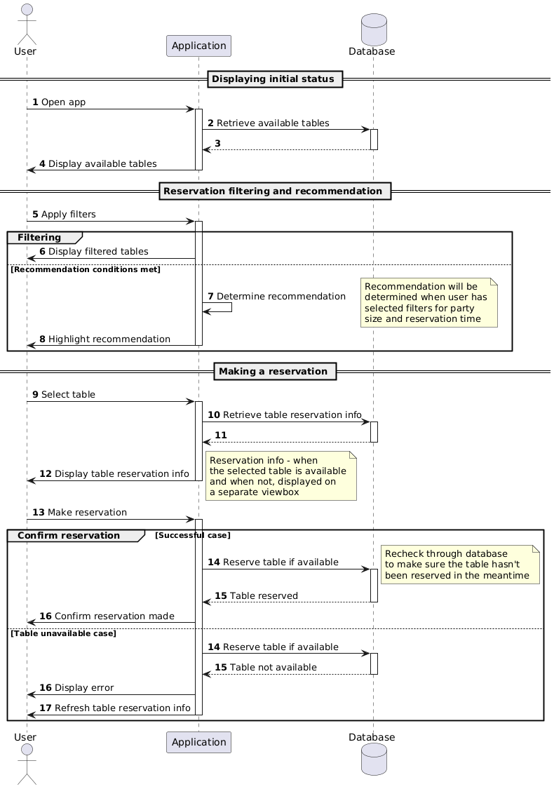

# cgi-proovitoo

Restorani broneerimissüsteem Spring Boot backendi ja React + TypeScript frontendiga.

## Eeldused

- Java 25 JDK
- Node.js 18+ ja npm

---

## Käivitamine

### 1. Klooni repo ja liigu kausta

```bash
git clone https://github.com/geilu/cgi-proovitoo
cd cgi-proovitoo
```

### 2. Käivita backend

**Linux / macOS**
```bash
cd backend
chmod +x gradlew
./gradlew bootRun
```
**Windows**
```bash
gradlew.bat bootRun
```

Backend jookseb **http://localhost:8080** peal. Andmebaasi sisestatakse demo andmed automaatselt esimesel jooksutamisel.
Gradle bootRun command tõenäoliselt jääb 80% peal seisma - see on normaalne, selle ajal backend on valmis ja parasjagu jookseb.
Peale seda võib järgmise sammu juurde minna.

### 3. Käivita frontend

**Teise terminali peal:**

```bash
cd frontend
npm install
npm run dev
```

### 4. Ava rakendus

Browseris mine lingile **http://localhost:5173**.

----
### API Dokumentatsioon

API dokumentatsiooniks on kasutatud **Swaggerit**. See on saadaval peale backendi käivitamist lingil **http://localhost:8080/swagger-ui/index.html#/**

----
## Tööprotsess

- Esialgu tegin sequence diagram'i, et paremini mõista rakenduse tööd ja planeerida välja 
erinevate osade omavahelist suhtlust enne koodi juurde minemist.

- Peale seda panin kirja, mida rakendus vajab ja mis järjekorras asjad vajaksid 
tegemist ja jätkasin selle info ja plaani põhjal rakenduse arendamist.

----
### Tekkinud probleemid

Põhilised tekkinud probleemid olid pigem logistilised küsimused.
- Kas klient peaks saama valida broneeringu kestuse?
  - Otsustasin, et jääb default value 2 tundi, et ei tekiks restoranil olukorda, kus
  klient valib broneeringu kestuseks 4 tundi, kuid lahkub 1.5h pärast ja restoranil
  tekib tühi auk.
  - Plaanisin suuremate gruppide puhul arvutada broneeringu kestus grupi suuruse järgi, kuid
  selle juurde ei jõudnud.
- Kuidas defineerida, millist ala hõivavad erinevad tsoonid (vaikne ala, terrassiala jms)?
  - Selleks, et laudade paigutus oleks muudetav ja laudu saaks ringi liigutada, panin laudadele 
  koordinaadid, mille järgi saab asetada neid ruudustikule frontendi poolel. Admin saaks siis ka neid laude
  ringi lohistada (see jäi hetkel tegemata) paigutuse muutmiseks.
  - Selle põhjal otsustasin configuration failis defineerida tsoonide miinimum-maksimum x ja y koordinaadid.
  Nende põhjal sai vaadata, et kui laud asetseb nende koordinaatide vahemikus, siis järelikult asetseb see
  antud tsoonis. Selle lahendusega oleks ka saanud kattuvaid tsoone teha (aknaalune + vaikne ala näiteks).

----
### Kulunud aeg
Proovitöö teostamiseks kulus umbes 28h.